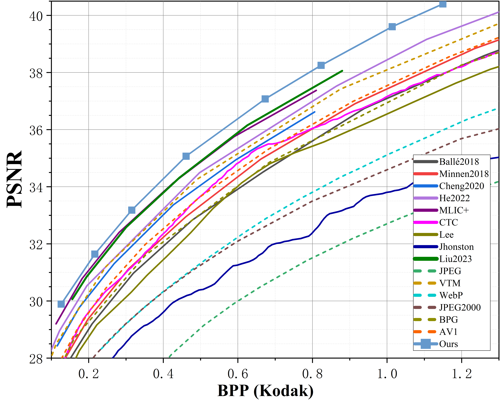
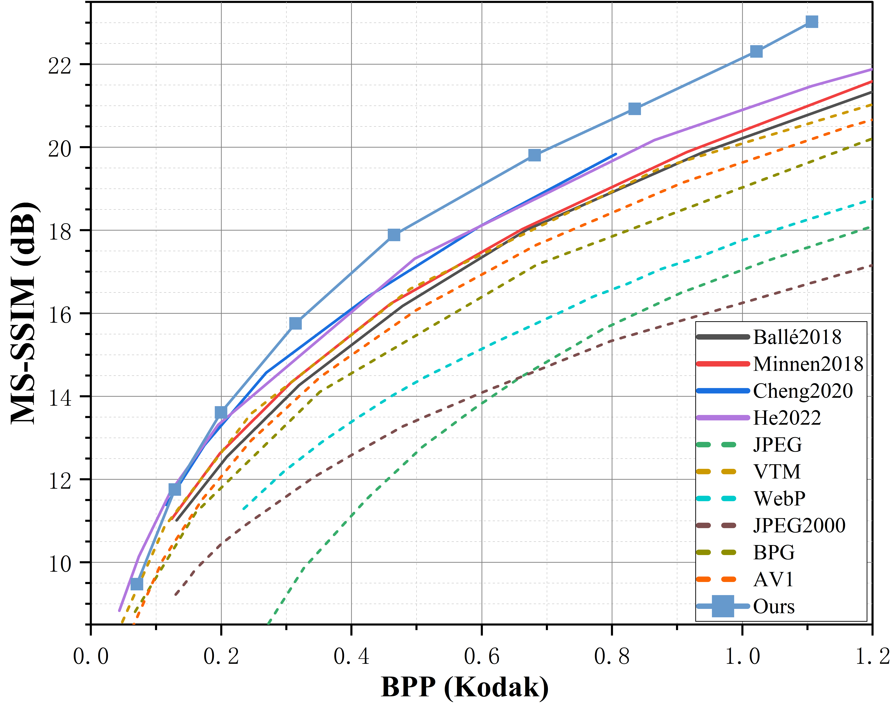

# GLIC: General Format Learned Image Compression

## <div align="center">Quick Start Examples</div>

<details open>
<summary>Install</summary>


Clone repo and
install [requirements.txt](https://github.com/DuBianJun-007/GLIC-General-Format-Learned-Image-Compression/blob/main/requirements.txt)
in a
[**Python>=3.8.0**](https://www.python.org/) environment, including
[**PyTorch>=1.7**](https://pytorch.org/get-started/locally/).

```bash
git clone https://github.com/DuBianJun-007/GLIC-General-Format-Learned-Image-Compression.git  # clone
cd GLIC-General-Format-Learned-Image-Compression
pip install -r requirements.txt  # install
```

</details>

<details open>
<summary>Model download</summary>

Downloaded model, put into model folder

| lambda | Link                                                                                        |
|--------|---------------------------------------------------------------------------------------------|
| 0.09   | [0.09](https://drive.google.com/file/d/1ca7J--RN_AdTdvquFGGW8qYVzaHXYp_5/view?usp=sharing)                                                                                    |
| 0.07   | [0.07](https://drive.google.com/file/d/1d9cZDyBPSOUq3qM0MNMLZuJ_YdRtn5Kl/view?usp=sharing)                                                                                    |
| 0.045  | [0.045](https://drive.google.com/file/d/1a3JJTKnKWNuw4ALChigETyDRc51Hlph0/view?usp=sharing)                                                                                   |
| 0.03   | [0.03](https://drive.google.com/file/d/1rDQIKeRlpC1Eyd_V1rF5PpGxXVzXHklX/view?usp=sharing)                                                                                    |
| 0.015  | [0.015](https://drive.google.com/file/d/1PRY_yD4z0ct6GZBVsxABHRYy6kkSPlhZ/view?usp=sharing)                                                                                   |
| 0.0075 | [0.0075](https://drive.google.com/file/d/1HEH38IWdVj5UTsIe6u1z-BijpormlRxK/view?usp=sharing)                                                                                  |
| 0.0042 | [0.0042](https://drive.google.com/file/d/1mWJlk-p0Ii3IzCfRwVvfWaWPLtTNHdZi/view?usp=sharing)                                                                                  |
| 0.002  | [0.002](https://drive.google.com/file/d/1qH6d5Bf5XhzTvr_eooE08jrPJK2SKl1g/view?usp=sharing) |

</details>

<details open>

<summary>Data download</summary>

Download training data and validation data

| Training data | [ImageNet](https://drive.google.com/file/d/15z_5x5m3hG2CzEI5mGz8Nw3JA2KHBNIh/view?usp=sharing) |
|---------------|------------------------------------------------------------------------------------------------|

Data preparation: ImageNet with the following folder structure.
```
│imageNet/
├──train/
│  ├── ILSVRC2016_********.JPEG
│  ├── ......
├──test/
│  ├── ILSVRC2012_********.jpg
│  ├── ......
```

| Validation data         | Link                                                                                        |
|-------------------------|---------------------------------------------------------------------------------------------|
| Kodak                   | [Kodak](https://drive.google.com/file/d/1Zg8ZpQNIzYBKTlwEFU8Fxbwsz-2cn7Oh/view?usp=sharing)                                                                                   |
| CLIC 2020 professional  | [CLIC 2020 professional](https://drive.google.com/file/d/1nrNUdEfg1elTq6dmMRnSPVtwtwnzlRAk/view?usp=sharing)                                                                                   |

</details>

<details open>
<summary>Inference</summary>
Sample inference test under the specified dataset, the test dataset should be put to the _dataset_val_ file:

```bash
#Defaults to the Kodak dataset
python Inference_GLIC.py 
#Specify a directory
python Inference_GLIC.py --dataset XXX
```

Requirements Package：
```
numpy~=1.26.1
pillow~=10.1.0
compressai~=1.1.5
opencv-python~=4.8.1.78
simpleitk~=2.3.0
```

</details>


<details open>
<summary>Training</summary>

The training data should be placed in the _dataset_train_ folder, directory structure:

```
--dataset_train
  --train
  --test
```

Sample training execution:

```bash
#Starting a new training program.
python train_GLIC.py --lambda 0.09 --batch-size 16 
#Continuing training in a checkpoint
python train_GLIC.py --lambda 0.09 --batch-size 16 --checkpoint XX
```

_checkpoint_ directory structure:

```
--checkpoint
  --best_checkpoint
  --checkpoint    
  --log  
  --updataModel
```

After training is complete, the model needs to be updated:

```bash
python updata.py --run XXXX  # XXXX is the checkpoint number, e.g. 1001
```
The updated model is stored in the updataModel folder for the checkpoint.

Some experimental results of paper submission:
<div style="display: flex;">
    <div style="flex: 1; margin: 5px;">
        
    </div>
    <div style="flex: 1; margin: 5px;">
        
    </div>
</div>


</details>